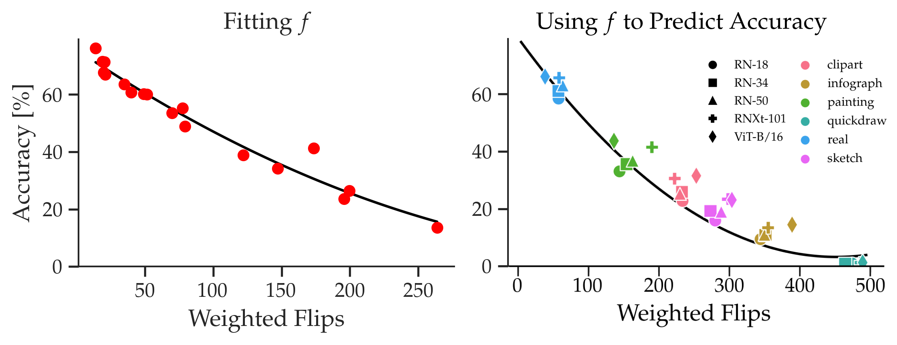

# The Entropy Enigma: Success and Failure of Entropy Minimization



This repository contains the code used in our ICML 2024 [paper](https://oripress.com/_pages/EntropyEnigma.pdf).
Our method allows you to estimate the accuracy of a model on a given dataset, while the model adapts to the dataset.

We show that method that use entropy minimization to adapt to their inputs work by clustering the embeddings of their inputs.
In essence, this works great as long as the clusters formed by entropy minimization stay close to 
the embeddings of training images. Eventually, entropy minimization causes the model to embed input images far away
from the embeddings of training images. This is what eventually decreases the model's accuracy to nearly 0, as 
we showed in our paper [RDumb: A simple approach that questions our progress in continual test-time adaptation](https://github.com/oripress/ccc).   

Using this, we propose a method to estimate the accuracy of a classifier on a given input dataset, 
without having access to the labels. Our method works by looking at how the model predictions change over time, as the model 
uses entropy minimization to adapt to its inputs. Concretely, we take a set of 1,000 input images, and run them through
the model before adaptation. We record the model's predicted class for every image. Then, at the end of adaptation, we run the same set of images 
through the model, and compare the model's current prediction to its prediction at the start. If the prediction changed,
we call that a label flip. To estimate accuracy, we plug the total number of label flips into our flips-to-accuracy function f.

Intuitively, if a model's accuracy is high on a certain dataset, embeddings of samples will probably be well clustered at the start, and not change much during 
entropy minimization. This would yield a low number of label flips. Conversely, if a model's accuracy is low, the embedding space will be disorganized, 
and entropy minimization will move the embeddings around, yielding many label flips. We elaborate on this in our paper. 


##Getting started
Running estimation requires just one argument. If you want to additionally use temperature scaling, 
you have to also provide a calibration dataset. 
```
python3 main.py \
    --data /path/to/dset/ \            # dataset you want to estimate
    --valdata /path/to/val_dset \      # validation dataset, if you want a temperature scaled model
```


## BibTeX
If you find this work helpful, please use the following citation:
```
@inproceedings{pres2024entropy,
  title={On calibration of modern neural networks},
  author={Press, Ori and Shwartz-Ziv, Ravid and LeCun, Yann and Bethge, Matthias},
  booktitle={International Conference on Machine Learning},
  year={2024},
  organization={PMLR}
}
```


## Acknowledgements
Much of model code is based on [RDumb](https://github.com/oripress/CCC/) which is based on [EATA](https://github.com/mr-eggplant/EATA/) code.
We also use [Temperature Scaling](https://github.com/gpleiss/temperature_scaling).
See the [LICENSE](https://github.com/oripress/EntropyEnigma/blob/master/LICENSE) for more details and licenses.
